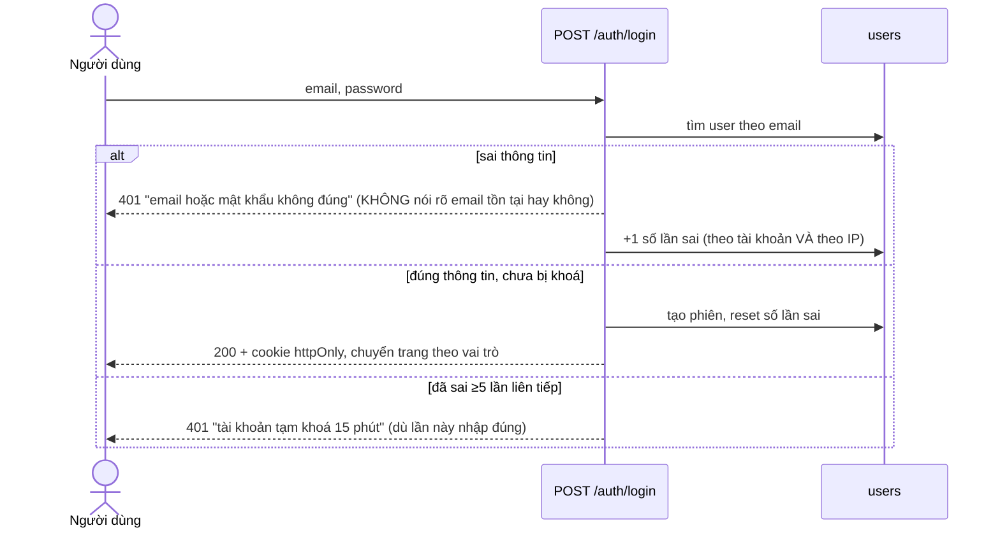
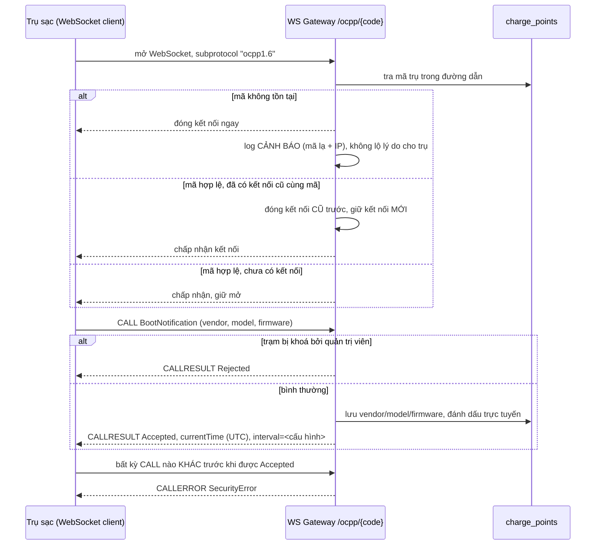
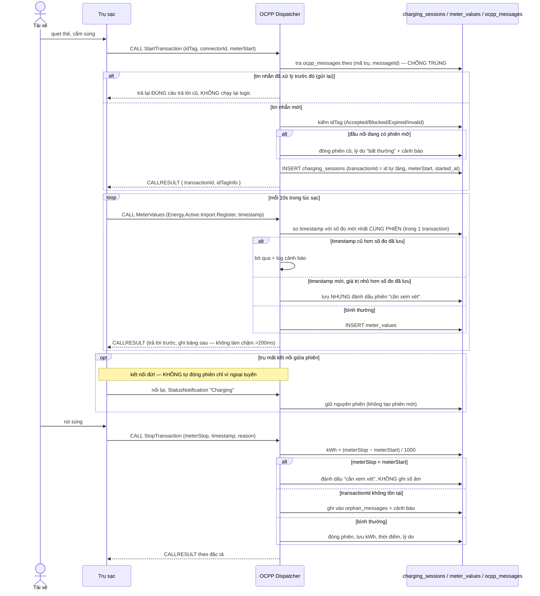
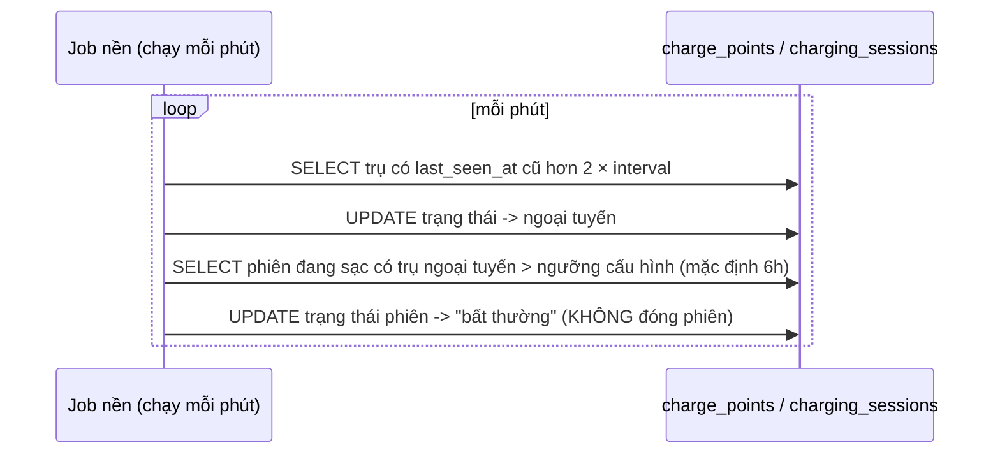
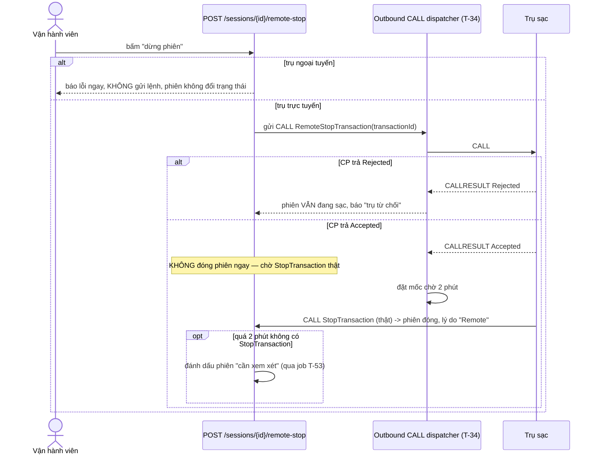
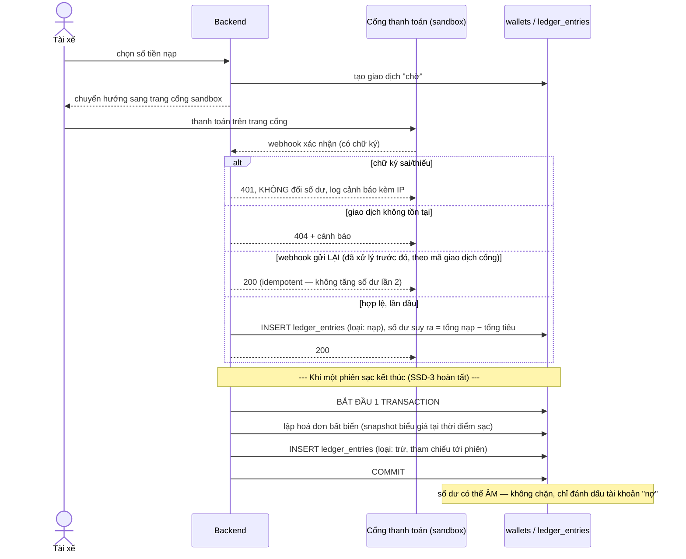

# Đặc tả SSD (System Sequence Diagram) — CSMS

> **SSD là gì trong tài liệu này**: sơ đồ tuần tự actor ↔ hệ thống, chỉ vẽ *thao
> tác nào gọi cái gì, theo thứ tự nào, ai chịu trách nhiệm quyết định gì* — không
> vẽ chi tiết nội bộ class. Mỗi SSD đi kèm **bảng ràng buộc** lấy thẳng từ AC/NFR
> trong backlog của bạn, để AI vide code không được tự suy diễn khác đi.
>
> Nếu bạn dùng "SSD" với nghĩa khác (ví dụ Solution Structure Document), nói tôi
> biết để chỉnh lại định dạng — nhưng nội dung ràng buộc bên dưới vẫn dùng được.

Áp dụng cho 6 luồng lõi, ưu tiên đúng thứ tự sprint 1–5 trong backlog (Ready/Next
tier). Các epic Later (đặt chỗ, phân bổ công suất, đối soát) làm SSD theo đúng
mẫu này khi tới sprint tương ứng.

---

## SSD-1. Đăng nhập (S-02)

**Ràng buộc bắt buộc:**
- Đếm sai lưu ở DB (cột trên `users`), **không** lưu biến trong tiến trình.
- Thông báo lỗi sai mật khẩu và sai email phải **giống hệt nhau**.
- Mọi API khác: phiên hết hạn → 401 + chuyển về trang đăng nhập.

---

## SSD-2. Trụ sạc kết nối OCPP + BootNotification (S-06, S-08, T-12, T-13, T-16, T-17)

**Ràng buộc bắt buộc:**
- Mã trụ được kiểm tra ở **đường dẫn WebSocket**, không tin dữ liệu trong thân
  tin nhắn.
- `interval` (khoảng nhịp tim) là tham số cấu hình, không hardcode.
- Đúng 1 kết nối sống cho mỗi mã trụ tại một thời điểm.
- Log chỉ ghi mã lạ + IP, **không log toàn bộ header**.

---

## SSD-3. Vòng đời một phiên sạc (S-17 → S-21, T-36 đến T-46)

Đây là luồng **lõi nhất** của cả hệ thống — mọi handler OCPP sau này bám theo
khung này.

**Ràng buộc bắt buộc (đây là phần hay bị AI vide code làm sai nhất):**
- `transactionId` = số nguyên tăng dần **do DB cấp**, không dùng timestamp.
- kWh = hiệu số đo cuối trừ số đo đầu, **không cộng dồn** từng lần `MeterValues`.
- So sánh thời gian số đo theo **mốc thời gian trong tin nhắn OCPP**, không theo
  giờ máy chủ lúc nhận.
- Chống trùng tin nhắn dựa vào bảng `ocpp_messages` ở DB, không dựa biến RAM.
- Tra bảng chống trùng + gọi handler nằm **cùng 1 transaction DB**.
- Trụ ngoại tuyến **không tự đóng phiên** — chỉ job nền (SSD-4) đánh dấu "cần
  xem xét" sau ngưỡng cấu hình (mặc định 6 giờ).

---

## SSD-4. Job nền phát hiện trụ/phiên bất thường (T-26, T-53)

**Ràng buộc bắt buộc:**
- Job chạy 2 lần liên tiếp mà không có gì đổi → **không được** ghi thêm gì (idempotent).
- Trạng thái ngoại tuyến phải **suy được từ `last_seen_at`** ngay cả khi job vừa
  khởi động lại và chưa kịp chạy — không phụ thuộc job có đang chạy hay không.
- Job chỉ **đánh dấu**, không tự đóng phiên — đóng là quyết định của người
  (vận hành viên, qua SSD-5 mở rộng).

---

## SSD-5. Vận hành viên dừng phiên từ xa (S-23, T-49, T-50)

**Ràng buộc bắt buộc:**
- Phiên **chỉ đóng khi có `StopTransaction` thật** từ trụ, không đóng ngay khi
  nhận `Accepted` từ `RemoteStopTransaction`.
- Mọi lệnh điều khiển từ xa (`Reset`, `RemoteStopTransaction`...) ghi 1 dòng
  `audit_logs`: người, lệnh, đối tượng, thời điểm, kết quả.

---

## SSD-6. Nạp ví qua webhook + trừ ví khi kết thúc phiên (S-35, S-37, S-39, S-41)

**Ràng buộc bắt buộc:**
- `ledger_entries` **chỉ INSERT**, không UPDATE tại chỗ — số dư luôn là **tổng
  cộng dồn từ sổ**, không lưu một cột "số dư hiện tại" làm nguồn sự thật riêng
  (nếu có cột cache, job đối chiếu phải phát hiện lệch và khoá giao dịch mới cho
  tới khi xử lý).
- Chống trùng webhook theo **mã giao dịch của cổng**, lưu ở DB — cùng nguyên
  tắc với SSD-3 (chống trùng OCPP).
- Trừ ví + lập hoá đơn nằm **trong cùng 1 transaction DB** — một phiên không
  bao giờ bị trừ 2 lần kể cả khi 2 phiên của cùng tài xế kết thúc đồng thời.
- Không lưu thông tin thẻ thanh toán ở đâu cả.

---

## Cách mở rộng SSD cho epic còn lại

Khi làm tới các epic Later (E-07 đặt chỗ, E-08 phân bổ công suất, E-09 đối soát),
tạo file `SSD-7...`, `SSD-8...` theo đúng khuôn:

1. Vẽ sequence diagram actor ↔ hệ thống ↔ (trụ sạc nếu có).
2. Bảng "Ràng buộc bắt buộc" **chỉ lấy từ cột AC/NFR trong file backlog gốc**,
   không tự bịa thêm ràng buộc mới.
3. Đánh dấu rõ bước nào phải nằm trong cùng 1 transaction DB.
4. Đánh dấu rõ đâu là hàm thuần (không đọc DB) cần tách riêng để test theo bảng.

Khi đưa cho AI vide code một story cụ thể, luôn dán kèm đúng đoạn SSD tương ứng
+ bảng ràng buộc — đó chính là "hợp đồng" AI phải tuân theo, không phải tự suy
diễn từ tên story.
