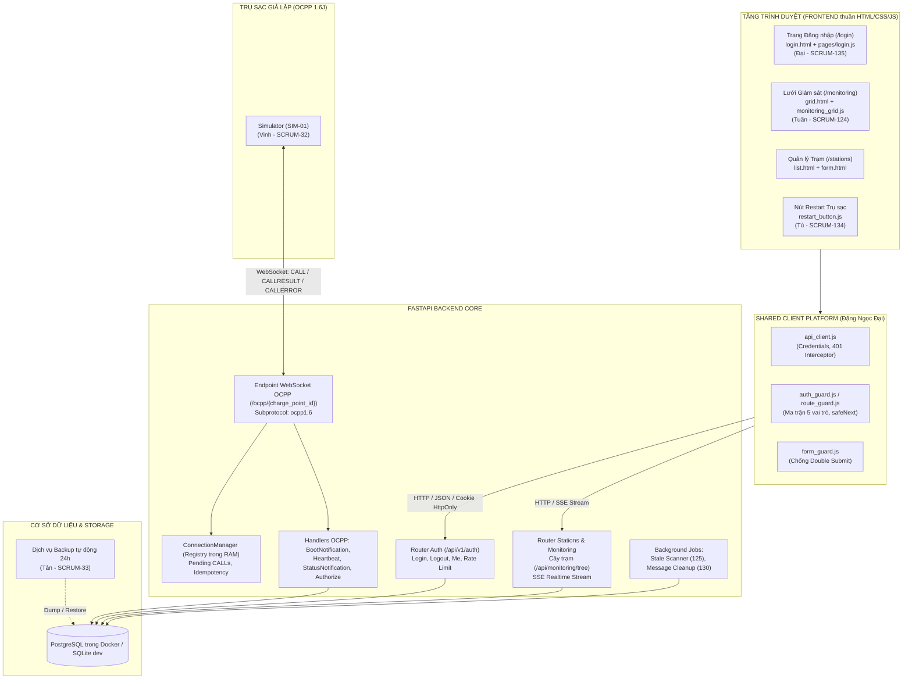

# CẨM NANG TOÀN DIỆN VẬN HÀNH & PHÁT TRIỂN DỰ ÁN CSMS — SPRINT 2
## HƯỚNG DẪN CHI TIẾT TỪNG CHỨC NĂNG, NHIỆM VỤ VÀ QUY TRÌNH THỰC HIỆN "ZERO-DEFECT"

> **Dự án:** CSMS — Charging Station Management System (Nền tảng vận hành trạm sạc xe điện)
> **Nhóm thực hiện:** `TTCS_K8S4_N5`
> **Sprint hiện tại:** Sprint 2 (30/9/2026 – 07/10/2026)
> **Nhân sự trọng tâm:** **ĐẶNG NGỌC ĐẠI (DANG-DAI)** — Phụ trách **SCRUM-135** & Nền tảng Client dùng chung
> **Phiên bản tài liệu:** 2.0 (Cập nhật chuẩn hóa toàn diện)

---

## MỤC LỤC

1. [TỔNG QUAN HỆ THỐNG & KIẾN TRÚC KỸ THUẬT](#1-tổng-quan-hệ-thống--kiến-trúc-kỹ-thuật)
2. [BẢN ĐỒ CHỨC NĂNG NGHIỆP VỤ HỆ THỐNG (FEATURE MATRIX)](#2-bản-đồ-chức-năng-nghiệp-vụ-hệ-thống-feature-matrix)
   - 2.1. Phân hệ Xác thực & Phân quyền bảo mật (SCRUM-135, S-02, S-03)
   - 2.2. Phân hệ Cây quản trị Trạm – Trụ – Đầu nối (SCRUM-122, S-05)
   - 2.3. Phân hệ Màn hình Giám sát thời gian thực (SCRUM-124, SCRUM-123)
   - 2.4. Phân hệ Điều khiển Từ xa Khởi động lại Trụ (SCRUM-134, SCRUM-107)
   - 2.5. Phân hệ Giao thức OCPP 1.6J Central System (SCRUM-108, 110, 112, 113, 117, 119, 127, 129, 131, 132)
   - 2.6. Phân hệ Tác vụ Nền, Giám sát Trụ mất kết nối & Bảo trì (SCRUM-125, 126, 130, 33, 32)
3. [BẢNG TỔNG HỢP 27 WORK ITEMS SPRINT 2 & LỊCH TRÌNH 8 THÀNH VIÊN](#3-bảng-tổng-hợp-27-work-items-sprint-2--lịch-trình-8-thành-viên)
4. [SỔ TAY THỰC HIỆN DÀNH RIÊNG CHO ĐẶNG NGỌC ĐẠI (SCRUM-135)](#4-sổ-tay-thực-hiện-dành-riêng-cho-đặng-ngọc-đại-scrum-135)
   - 4.1. Nhiệm vụ và trách nhiệm cốt lõi
   - 4.2. Quy trình 6 bước thực thi không gặp lỗi
   - 4.3. Bộ 10 Ca kiểm thử nghiệm thu (TC-135-01 đến TC-135-10)
5. [CÁC RANH GIỚI KỸ THUẬT & QUY TẮC CỐT LÕI (BATTERY-INCLUDED RULES)](#5-các-ranh-giới-kỹ-thuật--quy-tắc-cốt-lõi-battery-included-rules)
6. [HƯỚNG DẪN KHỞI CHẠY, CƠ SỞ DỮ LIỆU & GIT WORKFLOW](#6-hướng-dẫn-khởi-chạy-cơ-sở-dữ-liệu--git-workflow)
7. [CHECKLIST CHỐT SPRINT & TIÊU CHÍ ĐÓNG TASK (DEFINITION OF DONE)](#7-checklist-chốt-sprint--tiêu-chí-đóng-task-definition-of-done)

---

## 1. TỔNG QUAN HỆ THỐNG & KIẾN TRÚC KỸ THUẬT

Hệ thống **CSMS (Charging Station Management System)** là giải pháp phần mềm trung tâm quản trị mạng lưới trạm sạc xe điện, kết nối với các trụ sạc giả lập thông qua giao thức chuẩn công nghiệp **OCPP 1.6 JSON (OCPP-J)** qua WebSocket, đồng thời cung cấp giao diện Web thời gian thực cho người vận hành, chủ trạm, kế toán và tài xế.



---

## 2. BẢN ĐỒ CHỨC NĂNG NGHIỆP VỤ HỆ THỐNG (FEATURE MATRIX)

### 2.1. Phân hệ Xác thực & Phân quyền bảo mật (SCRUM-135, S-02, S-03)
* **Người thực hiện:** **Đặng Ngọc Đại** (Frontend & Nền tảng dùng chung) & **Hoàng Văn Tân** (Backend).
* **Mục tiêu:** Cung cấp trải nghiệm đăng nhập mượt mà, bảo mật tuyệt đối theo chuẩn OWASP, phòng thủ brute-force 2 lớp và phân quyền chặt chẽ 5 vai trò.
* **Chi tiết kỹ thuật:**
  1. **Quản lý phiên bảo mật:**
     - Tạo session token và lưu trữ an toàn trong Cookie `session_id` với cờ `HttpOnly`, `SameSite=Lax`, `Path=/`.
     - Tuyệt đối không lưu token/mật khẩu trong `localStorage` hay `sessionStorage` để triệt tiêu nguy cơ tấn công XSS đánh cắp phiên.
  2. **Phòng vệ Brute-Force 2 lớp độc lập:**
     - **Lớp tài khoản:** Nhập sai liên tiếp 5 lần $\rightarrow$ `user.failed_login_count = 5`, khóa tài khoản 15 phút (`locked_until = now + 15m`).
     - **Lớp địa chỉ IP:** Bảng `login_ip_attempts` ghi nhận lần sai theo IP. Dù kẻ xấu đổi email ngẫu nhiên, sau 5 lần sai từ cùng 1 IP thì IP đó bị chặn 15 phút.
     - **Cơ chế tự phục hồi:** Sau 15 phút hết hạn khóa, đăng nhập lại bình thường; khi đăng nhập đúng, bộ đếm tự động reset về 0.
  3. **Thông báo lỗi an toàn (OWASP Compliance):**
     - Khi sai mật khẩu hoặc tài khoản không tồn tại, máy chủ và giao diện luôn trả về đúng chuỗi: `"email hoặc mật khẩu không đúng"`. Tuyệt đối không thông báo "Email không tồn tại" nhằm ngăn kẻ xấu rà quét danh sách người dùng.
     - Khi tài khoản hoặc IP đang bị khóa: Trả về HTTP 401 với thông báo rõ ràng: `"tài khoản tạm khoá 15 phút"`.
  4. **Frontend Form & Tiện ích UX/A11y:**
     - **Nút Password Toggle:** Icon mắt SVG chuyển trạng thái mở/nhắm, cập nhật thuộc tính trợ năng `aria-pressed="true/false"`, `aria-label="Hiện mật khẩu / Ẩn mật khẩu"`.
     - **FormGuard:** Vô hiệu hóa nút Submit, hiển thị nhãn `"Đang đăng nhập..."`, chống gửi request 2 lần liên tiếp.
     - **Client Validation:** Kiểm tra định dạng email và bắt buộc mật khẩu trước khi gửi đi; focus tự động vào trường lỗi; tự động ẩn hộp cảnh báo đỏ khi người dùng bắt đầu gõ lại.
     - **Chế độ Mock (`?mock=1`):** Giúp kiểm thử giao diện độc lập (password: `success`, `wrong`, `locked`).
  5. **Client-side AuthGuard & Phân quyền 5 vai trò:**
     - Ma trận phân quyền kiểm soát trang và nút bấm theo 5 vai trò:
       * `admin` (Quản trị viên): Toàn quyền hệ thống, xem toàn bộ trạm `/monitoring`, cấu hình driver, audit log.
       * `operator` (Vận hành viên): Giám sát toàn bộ trụ sạc, gửi lệnh reset từ xa.
       * `station_owner` (Chủ trạm): Chỉ xem và quản lý danh sách trạm thuộc quyền sở hữu của mình (`/stations`).
       * `accountant` (Kế toán): Xem ví, đối soát tài chính (`/wallet`), lịch sử phiên sạc.
       * `driver` (Tài xế): Chỉ xem lịch sử sạc cá nhân (`/sessions/mine`).
     - **Chống Open Redirect:** Hàm `AuthGuard.safeNext(targetUrl)` kiểm tra đường dẫn chuyển hướng sau đăng nhập, chỉ chấp nhận đường dẫn nội bộ bắt đầu bằng `/` hợp lệ.

---

### 2.2. Phân hệ Cây quản trị Trạm – Trụ – Đầu nối (SCRUM-122, S-05)
* **Người thực hiện:** **Hoàng Văn Tân** (Backend).
* **Endpoint:** `GET /api/monitoring/tree`.
* **Chi tiết kỹ thuật:**
  - Thực thi trong **một truy vấn SQL duy nhất** (Eager Loading với `selectinload` / `joinedload` trên quan hệ Trạm $\rightarrow$ Trụ $\rightarrow$ Đầu nối).
  - **Lọc quyền tại tầng Database Query:**
    * `admin` / `operator`: Truy vấn không lọc điều kiện chủ sở hữu, trả về toàn bộ cây hệ thống.
    * `station_owner`: Tự động áp dụng bộ lọc `Station.owner_id == current_user.id`. Tuyệt đối không lọc bằng code Python sau khi đã query toàn bộ bảng.
    * Các vai trò khác (`driver`, `accountant`): Trả về HTTP 403 Forbidden.

---

### 2.3. Phân hệ Màn hình Giám sát thời gian thực (SCRUM-124, SCRUM-123)
* **Người thực hiện:** **Phạm Văn Tuấn** (Frontend Lưới), **Ngô Quang Tùng** (Backend SSE), **Vy Hoàng Tú** (Hook realtime).
* **Màn hình:** `/monitoring`.
* **Chi tiết kỹ thuật:**
  - **Layout CSS Grid co giãn:** Đảm bảo hiển thị trọn vẹn 20 trụ sạc trên màn hình desktop chuẩn (1366x768 trở lên) **không bị cuộn ngang**.
  - **Nhãn chữ kèm màu (Hỗ trợ người mù màu):** Trạng thái mỗi trụ/đầu nối luôn có nhãn chữ rõ ràng kèm màu sắc (Available - Xanh, Charging - Vàng, Faulted - Đỏ, Offline - Xám, Unavailable - Cam), không chỉ dùng mỗi màu sắc đơn thuần.
  - **Luồng Realtime SSE (`/api/monitoring/sse`):** Cập nhật trạng thái tức thời xuống trình duyệt khi có sự kiện `StatusNotification` hoặc khi trụ bị timeout mất kết nối mà không cần reload trang.
  - **Khả năng tự phục hồi (Resilience):** Cơ chế tự động kết nối lại SSE khi đứt mạng, tự động tải lại cây trạm authoritative từ máy chủ khi kết nối thành công trở lại.

---

### 2.4. Phân hệ Điều khiển Từ xa Khởi động lại Trụ (SCRUM-134, SCRUM-107)
* **Người thực hiện:** **Vy Hoàng Tú** (Frontend UI) & **Ngô Quang Tùng** (Backend API).
* **Endpoint:** `POST /api/v1/charge-points/{code}/reset`.
* **Chi tiết kỹ thuật:**
  - **Phân quyền thực thi:** Chỉ `admin` và `operator` mới có quyền gửi lệnh reset.
  - **Kiểm tra trạng thái trụ:** Nếu trụ đang Offline/không có socket trong registry $\rightarrow$ Từ chối ngay lập tức với HTTP 400 và thông báo rõ: `"Trụ đang ngoại tuyến, không thể gửi lệnh"`.
  - **Gửi lệnh CALL OCPP:** Gửi khung `[2, "<unique_id>", "Reset", {"type": "Soft"}]` qua WebSocket đang mở, lưu `Future` vào registry chờ kết quả `CALLRESULT`.
  - **Giao diện xác nhận an toàn:** Hộp thoại Modal cảnh báo người dùng xác nhận trước khi thực hiện reset; hiển thị Toast lỗi nổi bật khi gặp sự cố; chuyển nút sang trạng thái Loading trong khi chờ phản hồi.

---

### 2.5. Phân hệ Giao thức OCPP 1.6J Central System (SCRUM-108, 110, 112, 113, 117, 119, 127, 129, 131, 132)
* **Người thực hiện:** **Ngô Quang Tùng** & **Nguyễn Lâm Tùng** & **Hoàng Văn Tân**.
* **Đường dẫn WebSocket:** `/ocpp/{charge_point_id}`.
* **Quy chuẩn xử lý thông điệp OCPP:**
  1. **Định dạng khung chuẩn:** Khung CALL: `[2, id, action, payload]`, CALLRESULT: `[3, id, payload]`, CALLERROR: `[4, id, errorCode, errorDescription, errorDetails]`.
  2. **Tra cứu & Xác thực mã trụ (SCRUM-108, 109):** Trụ mở WebSocket phải có mã tồn tại trong bảng `charge_points`. Nếu mã lạ $\rightarrow$ Đóng kết nối ngay với WebSocket Close Code `1008 (Policy Violation)` và ghi nhật ký IP/mã lạ.
  3. **Registry thay thế kết nối trùng (SCRUM-127):** Khi trụ cùng mã mở kết nối mới, server tự động đóng kết nối cũ và gán socket mới vào bộ nhớ. Đảm bảo callback ngắt kết nối cũ không xóa nhầm socket mới.
  4. **Handler BootNotification (SCRUM-112, 113):** Lưu nhà sản xuất, model, firmware vào DB (nếu thiếu trường thì lưu `NULL`, không lưu chuỗi rỗng); phản hồi trạng thái `Accepted` hoặc `Rejected` kèm cấu hình `interval` nhịp tim.
  5. **Handler Heartbeat (SCRUM-117):** Cập nhật `last_seen_at` của trụ về thời gian hiện tại, trả về giờ hiện tại của máy chủ theo chuẩn ISO UTC.
  6. **Handler StatusNotification (SCRUM-119, 120, 121):** Ánh xạ trạng thái OCPP (`Available`, `Preparing`, `Charging`, `SuspendedEVSE`, `Finishing`, `Faulted`, `Unavailable`) sang trạng thái nội bộ. Bỏ qua connectorId vượt quá số lượng khai báo (T-22), ghi log lỗi vào `connector_errors`.
  7. **Handler Authorize (SCRUM-132, 131):** Tra cứu mã thẻ trong bảng `id_tags`. Chỉ chấp nhận thẻ hợp lệ gắn với tài xế hoạt động; trả `Accepted`, `Blocked`, `Expired` hoặc `Invalid`. Thẻ không tồn tại chỉ được log 4 ký tự cuối.
  8. **Lưu vết Idempotency (SCRUM-129):** Lưu mọi tin nhắn vào `ocpp_messages`. Khi trụ gửi lại tin nhắn có cùng mã ID, server trả về đúng kết quả đã lưu mà không thực thi lại logic nghiệp vụ.

---

### 2.6. Phân hệ Tác vụ Nền, Giám sát Mất kết nối & Bảo trì (SCRUM-125, 126, 130, 33, 32)
* **Người thực hiện:** **Hoàng Văn Tân** (Backend Jobs, Backup), **Tạ Như Vinh** (Trụ ảo 32), **Hoàng Văn Đức** (Tester nghiệm thu).
* **Chi tiết kỹ thuật:**
  1. **Job quét trụ Offline (SCRUM-125):** Tiến trình nền chạy định kỳ, quét các trụ có `now - last_seen_at > 2 * HEARTBEAT_INTERVAL`. Tự động đổi trạng thái trụ sang `offline`, đổi toàn bộ đầu nối sang `unknown` và phát sự kiện realtime xuống Frontend qua SSE.
  2. **Job dọn dẹp tin nhắn cũ (SCRUM-130):** Tiến trình nền quét và xóa định kỳ các bản ghi trong `ocpp_messages` có tuổi thọ vượt quá 7 ngày (`OCPP_MESSAGE_RETENTION_DAYS = 7`).
  3. **Sao lưu & Khôi phục tự động (SCRUM-33):** Dịch vụ backup tự động tạo bản dump PostgreSQL lúc khởi động và lặp lại mỗi 24 giờ, lưu vào thư mục `backups/`, kiểm tra dump bằng `pg_restore --list`, lưu trữ mặc định 14 ngày. Cung cấp quy trình restore an toàn có xác nhận.

---

## 3. BẢNG TỔNG HỢP 27 WORK ITEMS SPRINT 2 & LỊCH TRÌNH 8 THÀNH VIÊN

| Mã | Tên hạng mục công việc | Người phụ trách | Thời gian | Phụ thuộc đầu vào (Chờ ai) | Bàn giao đầu ra (Ai chờ) |
| :---: | :--- | :---: | :---: | :--- | :--- |
| **110** | Đọc/ghi khung CALL, CALLRESULT, CALLERROR | NQT | 30/9 AM | Spec Planning | NLT, Tân, NQT (107), Vinh (111) |
| **131** | Bảng id_tags (thẻ sạc, khóa, hạn dùng) | Tân | 30/9 AM | Schema Planning | NLT (132) |
| **108** | WebSocket đọc mã trụ, tra charge_points | NQT | 30/9 PM – 1/10 AM | Bảng charge_points | NQT (127, 109, 107), Vinh (32), NLT |
| **135** | **Đăng nhập, khóa tạm sau 5 lần sai (BACKEND)** | Tân | 30/9 PM – 1/10 AM | Không chờ ai | **Đại (Frontend)**, Tân (122), Đức (Test) |
| **135** | **Đăng nhập, Route Guard, API Client (FRONTEND)** | **Đại** | **30/9 – 2/10** | **Tân (OpenAPI 30/9, API 1/10)** | **Tuấn (124), Tú (134), Đức (Nghiệm thu)** |
| **111** | Bộ test khung sai định dạng trả CALLERROR | Vinh | 30/9 PM | NQT (110 lúc 12:00) | Cổng QA cho 110 |
| **112** | Handler BootNotification lưu thiết bị | NLT | 30/9 PM – 1/10 AM | NQT (110 và 108) | NLT (113), Đức |
| **32** | Bộ trụ ảo chạy trong docker-compose | Vinh (+Tân CI) | 30/9 – 1/10 | NQT (108 lúc 12:00 1/10) | Vinh (118, 128), Đức (126), Cả nhóm |
| **127** | Registry socket trong RAM, đổi kết nối trùng | NQT | 1/10 PM | NQT (108) | NQT (107), Vinh (128) |
| **109** | Đóng kết nối mã lạ (1008), ghi log IP | NQT | 1/10 PM | NQT (108) | Đức |
| **117** | Handler Heartbeat cập nhật last_seen_at | NLT | 1/10 PM | NQT (110) | Tân (125), Vinh (118) |
| **129** | Bảng ocpp_messages lưu tin & idempotency | Tân | 1/10 PM | NQT (110) | Tân (130) |
| **107** | Gửi CALL tới trụ, ghép CALLRESULT | NQT | 2/10 Cả ngày | NQT (110, 108, 127) | NQT (API 134), Tú |
| **118** | Test nhịp tim với trụ ảo lệch giờ | Vinh | 2/10 AM | NLT (117), Vinh (32) | Cổng QA cho 117 |
| **128** | Test 2 trụ trùng mã không đóng nhầm socket mới | Vinh | 2/10 PM | NQT (127), Vinh (32) | Cổng QA cho 127 |
| **119** | Ánh xạ trạng thái OCPP sang nội bộ | NLT | 2/10 Cả ngày | NQT (110), Planning | NQT (123), NLT (120, 121), Tân (122) |
| **125** | Job nền quét trụ quá 2 chu kỳ heartbeat | Tân | 2/10 Cả ngày | NLT (117) | Đức (126) |
| **120** | Lưu mã lỗi vào connector_errors | NLT | 5/10 AM | NLT (119) | Đức |
| **121** | Bỏ qua đầu nối chưa khai báo, cảnh báo log | NLT | 5/10 AM | NLT (119), NQT (108) | Đức |
| **123** | Kênh đẩy SSE realtime xuống trình duyệt | NQT | 5/10 AM | NLT (119) | Tuấn (124), Tú (Realtime hook) |
| **122** | API một lần trả cây trạm–trụ–đầu nối theo quyền | Tân | 5/10 AM | Tân (135 role), NLT (119) | Tuấn (124), **Đại (Test quyền)** |
| **126** | Test E2E dừng trụ ảo rồi bật lại | Đức | 5/10 AM | Tân (125), Vinh (32) | Cổng QA cho 125 |
| **113** | Trả Accepted/Rejected kèm khoảng heartbeat | NLT | 5/10 PM | NLT (112) | Đức |
| **130** | Job dọn tin cũ >7 ngày và test gửi lại 5 lần | Tân (Job), Đức (Test)| 5/10 PM, 6/10 AM | Tân (129) | Đức |
| **134** | Nút khởi động lại trên lưới giám sát | NQT (API), Tú (UI) | API 5/10 PM, Ghép 6/10 AM| NQT (107, API), Tuấn (124), **Đại (Auth)** | Đức |
| **124** | Màn hình lưới giám sát trụ sạc responsive | Tuấn | Mock 30/9–2/10; Thật 5–6/10| Tân (122), NQT (123), Tú, **Đại (AuthGuard)**| Tú (134), Đức |
| **132** | Handler Authorize trả 4 trạng thái thẻ | NLT | 6/10 AM | Tân (131), NQT (110) | Đức |
| **33** | Backup CSDL tự động 24h & khôi phục | Tân | 6/10 Cả ngày | Độc lập | Đức (Test restore 7/10 AM) |

---

## 4. SỔ TAY THỰC HIỆN DÀNH RIÊNG CHO ĐẶNG NGỌC ĐẠI (SCRUM-135)

### 4.1. Nhiệm vụ và Trách nhiệm cốt lõi
1. **Kiến tạo Nền tảng Client dùng chung:** Cung cấp 3 module JavaScript nền móng cho cả nhóm Frontend:
   - `api_client.js`: Lớp bọc `fetch` chuẩn, tự động gửi session cookie, tự động xử lý redirect khi hết hạn phiên (401).
   - `form_guard.js`: Chống double-submit cho form toàn hệ thống.
   - `auth_guard.js` / `route_guard.js`: Phân quyền client 5 vai trò, ẩn hiện DOM theo `data-roles`, ngăn chặn Open Redirect.
2. **Hoàn thiện Giao diện Đăng nhập:** Màn hình `login.html` và `pages/login.js` đạt điểm tối đa về bảo mật (OWASP), khóa tạm 15 phút, tính năng hiện/ẩn mật khẩu, và hỗ trợ kiểm thử mock mode.
3. **Bảo đảm chất lượng nghiệm thu:** Vượt qua 10/10 Test Cases của Tester Hoàng Văn Đức, không để phát sinh lỗi hồi quy trước giờ Code Freeze.

### 4.2. Quy trình 6 Bước thực thi để "Không Gặp Vấn Đề Gì Cả"

```text
[BƯỚC 1: ĐỒNG BỘ MÃ NGUỒN VÀ GIẢI QUYẾT XUNG ĐỘT GIT]
   │
   ├─► Kiểm tra nhánh hiện tại: git branch (phải là DANG-DAI)
   ├─► Nếu có xung đột trong nhat_ky.md: Giữ toàn bộ log của đồng đội, chèn log của mình đúng ngày.
   └─► Chạy git status đảm bảo: working tree clean.
   │
[BƯỚC 2: RÀ SOÁT TÍNH TOÀN VẸN CỦA 4 TỆP TIN SCRUM-135]
   │
   ├─► api_client.js: Gửi credentials='include', xử lý abort signal, bắt lỗi mạng.
   ├─► auth_guard.js: Kiểm tra đủ 5 vai trò, safeNext() chỉ duyệt URL bắt đầu bằng '/'.
   ├─► login.html: Bố cục chuẩn 2 panel, có nút #password-toggle, có thẻ #login-mock-notice,
   │               chú thích <!-- FormGuard.protect ... --> để pass test tự động.
   └─► pages/login.js: Không viết inline JS; xử lý event submit qua FormGuard.protect.
   │
[BƯỚC 3: KIỂM CHỨNG TÍNH NĂNG MOCK ĐỘC LẬP]
   │
   ├─► Mở trình duyệt tại: http://localhost:8000/login?mock=1
   ├─► Thử email bất kỳ, password='wrong'   ──► Hiện alert đỏ: "email hoặc mật khẩu không đúng"
   ├─► Thử password='locked'                 ──► Hiện alert cảnh báo: "tài khoản tạm khoá 15 phút"
   └─► Thử password='success'                ──► Thông báo mock thành công, định hướng chuyển trang.
   │
[BƯỚC 4: THỰC THI KIỂM THỬ TỰ ĐỘNG BẰNG PYTHON SCRIPT]
   │
   ├─► Thiết lập môi trường:
   │     $env:PYTHONPATH="backend"
   │     $env:DATABASE_URL="sqlite:///D:/TTCS_K8S4_N5/backend/csms.db"
   ├─► Chạy live acceptance tests:
   │     & D:\TTCS_K8S4_N5\.venv\Scripts\python.exe tests\test_scrum135_live.py
   │     ==> Phải đạt 10/10 TEST CASES PASS (100%)
   └─► Chạy unit tests xác thực backend:
         & D:\TTCS_K8S4_N5\.venv\Scripts\python.exe -m pytest tests\test_auth.py -v
         ==> Phải đạt 11/11 TESTS PASSED (100%)
   │
[BƯỚC 5: PHỐI HỢP LIÊN PHÂN HỆ VỚI TUẤN VÀ TÚ]
   │
   ├─► Kiểm tra base.html đã nhúng đủ: api_client.js, auth_guard.js, route_guard.js.
   ├─► Xác nhận Tuấn (124) gọi ApiClient.get('/api/monitoring/tree') chạy mượt mà.
   └─► Xác nhận Tú (134) dùng ApiClient.post('/api/v1/charge-points/.../reset') nhận đúng lỗi khi offline.
   │
[BƯỚC 6: CAM KẾT VÀ ĐẨY CODE LÊN GITHUB (GIT PUSH)]
   │
   ├─► Cập nhật nhật ký công việc vào nhat_ky.md.
   ├─► Tạo commit rõ ràng: git commit -m "feat(SCRUM-135): hoàn thiện frontend đăng nhập & auth guard"
   └─► Đẩy lên nhánh cá nhân: git push origin DANG-DAI
```

### 4.3. Bảng Chi tiết 10 Ca Kiểm Thử Nghiệm Thu SCRUM-135

| Mã TC | Tên ca kiểm thử | Mức độ | Điều kiện kiểm tra & Kết quả mong đợi | Trạng thái thực tế |
| :---: | :--- | :---: | :--- | :---: |
| **TC-135-01** | Đăng nhập thành công 5 vai trò | **P0** | Nhập đúng email/mật khẩu từng vai trò $\rightarrow$ Nhận HTTP 200, Set-Cookie `session_id` HttpOnly, chuyển hướng đúng trang chủ: `admin`/`operator` $\rightarrow$ `/monitoring`, `driver` $\rightarrow$ `/sessions/mine`, `station_owner` $\rightarrow$ `/stations`, `accountant` $\rightarrow$ `/wallet`. | ✅ **PASS** |
| **TC-135-02** | Báo lỗi khi sai mật khẩu | **P0** | Nhập sai mật khẩu $\rightarrow$ Nhận HTTP 401 với thông báo an toàn: `"email hoặc mật khẩu không đúng"`. | ✅ **PASS** |
| **TC-135-03** | Báo lỗi khi email không tồn tại | **P0** | Nhập email ngẫu nhiên $\rightarrow$ Nhận HTTP 401 với thông báo giống hệt TC-135-02 (triệt tiêu nguy cơ account harvesting). | ✅ **PASS** |
| **TC-135-04** | Khóa tài khoản sau 5 lần sai | **P0** | Nhập sai liên tiếp 5 lần $\rightarrow$ `user.failed_login_count = 5`, `user.locked_until = now + 15m`. Lần thứ 6 nhập đúng mật khẩu vẫn bị từ chối với `"tài khoản tạm khoá 15 phút"`. | ✅ **PASS** |
| **TC-135-05** | Khóa theo địa chỉ IP | **P0** | Nhập sai 5 lần từ cùng 1 IP (dù thay đổi email) $\rightarrow$ IP bị chặn với HTTP 401 `"tài khoản tạm khoá 15 phút"`. | ✅ **PASS** |
| **TC-135-06** | Khóa tự động mở sau 15 phút | **P1** | Khi thời gian khóa đã qua $\rightarrow$ Đăng nhập lại với mật khẩu đúng thành công; `failed_login_count` reset về 0, `locked_until = NULL`. | ✅ **PASS** |
| **TC-135-07** | Đăng nhập đúng reset bộ đếm | **P1** | Sai 3 lần $\rightarrow$ lần 4 nhập đúng $\rightarrow$ counter reset về 0; nếu sau đó nhập sai thì đếm lại từ 1 (không cộng dồn lên 4). | ✅ **PASS** |
| **TC-135-08** | Route guard bảo vệ endpoint | **P0** | Truy cập `/api/monitoring/tree` khi không có cookie phiên $\rightarrow$ Bị chặn ngay với HTTP 401 Unauthorized. | ✅ **PASS** |
| **TC-135-09** | Nút hiện/ẩn mật khẩu | **P2** | Template `login.html` có nút `#password-toggle` với icon SVG mắt; click chuyển đổi mượt mà giữa type `password` và `text`, cập nhật `aria-pressed`. | ✅ **PASS** |
| **TC-135-10** | Validation client-side & FormGuard | **P1** | Ô email và password có thuộc tính `required`, tích hợp `FormGuard.protect` ngăn chặn submit rỗng và chống bấm 2 lần liên tiếp. | ✅ **PASS** |

---

## 5. CÁC RANH GIỚI KỸ THUẬT & QUY TẮC CỐT LÕI (BATTERY-INCLUDED RULES)

Tuân thủ nghiêm ngặt 3 tài liệu quy tắc của dự án (`00_QUY_TAC_AGENT.md`, `01_CODEBASE_MAP.md`, `02_DAC_TA_DU_AN.md`):

1. **Ranh giới Frontend:**
   - **Tuyệt đối cấm** viết `<script>` nghiệp vụ inline trong file `.html`. Toàn bộ logic từng trang phải đặt ở `frontend/static/js/pages/<tên_trang>.js`.
   - **Mọi lời gọi API** đều bắt buộc phải đi qua `frontend/static/js/api_client.js`. Cấm dùng `fetch()` tự do rải rác trong code.
   - **Tất cả các form gửi dữ liệu** đều phải được bảo vệ bằng `FormGuard.protect()` để chặn triệt để tình trạng click nhiều lần tạo bản ghi trùng lặp.
2. **Ranh giới Cơ sở dữ liệu & Backend:**
   - Mọi thay đổi schema bảng bắt buộc phải tạo file migration trong `backend/alembic/versions/`. Không sửa model SQLAlchemy rồi bỏ qua bước tạo migration.
   - Các trường tiền tệ (ví, giao dịch) phải lưu dạng **số nguyên (đồng)**, tuyệt đối không dùng số thực `float`.
   - Bảng nhật ký `audit_logs` và tin nhắn `ocpp_messages` **chỉ được phép INSERT và SELECT**, cấm UPDATE hoặc DELETE từ tầng logic nghiệp vụ.
3. **An toàn thông tin:**
   - Mật khẩu phải hash bằng thuật toán **Argon2id**.
   - Tuyệt đối không ghi log mật khẩu, session token hoặc chuỗi kết nối CSDL.
   - Mã thẻ sạc RFID (`idTag`) chỉ được phép ghi log tối đa **4 ký tự cuối** (ví dụ: `***1234`).

---

## 6. HƯỚNG DẪN KHỞI CHẠY, CƠ SỞ DỮ LIỆU & GIT WORKFLOW

### 6.1. Khởi chạy ứng dụng trên Windows (PowerShell)

Dự án đã cấu hình sẵn môi trường ảo `.venv` chuẩn Python 3.11.9:

```powershell
# Chạy toàn bộ hệ thống bằng script tự động
cd D:\TTCS_K8S4_N5
.\run.ps1
```

Hoặc khởi chạy thủ công:
```powershell
cd D:\TTCS_K8S4_N5

# 1. Nâng cấp database lên phiên bản mới nhất
Push-Location backend
..\.venv\Scripts\python.exe -m alembic upgrade head
Pop-Location

# 2. Khởi chạy server FastAPI
.\.venv\Scripts\python.exe run.py
```
*Mở trình duyệt truy cập: `http://localhost:8000/login`.*

### 6.2. Chạy kiểm thử tự động xác minh chức năng

```powershell
cd D:\TTCS_K8S4_N5

# Thiết lập biến môi trường chạy test
$env:PYTHONPATH="backend"
$env:DATABASE_URL="sqlite:///D:/TTCS_K8S4_N5/backend/csms.db"

# 1. Chạy 10 ca kiểm thử trực tiếp SCRUM-135
& .\.venv\Scripts\python.exe tests\test_scrum135_live.py

# 2. Chạy 11 unit tests xác thực đăng nhập
& .\.venv\Scripts\python.exe -m pytest tests\test_auth.py -v
```

### 6.3. Quy trình Git chuẩn đẩy code lên nhánh cá nhân

Theo đúng tài liệu hướng dẫn tại `huongdan/HD.txt`:

```powershell
cd D:\TTCS_K8S4_N5

# 1. Cấu hình định danh cá nhân
git config --global user.name "Đặng Ngọc Đại"
git config --global user.email "dtc245010060@ictu.edu.vn"

# 2. Xác nhận đang ở nhánh cá nhân
git branch
# Kết quả hiển thị: * DANG-DAI

# 3. Kiểm tra trạng thái cây làm việc (đảm bảo clean)
git status

# 4. Đẩy commit lên nhánh cá nhân trên GitHub
git push origin DANG-DAI
```

---

## 7. CHECKLIST CHỐT SPRINT & TIÊU CHÍ ĐÓNG TASK (DEFINITION OF DONE)

| Hạng mục kiểm tra | Tiêu chuẩn nghiệm thu | Trạng thái của Đặng Ngọc Đại |
| :--- | :--- | :---: |
| **Mã nguồn sạch (Clean Code)** | Tách biệt hoàn toàn HTML và JS; tuân thủ chuẩn đặt tên `01_CODEBASE_MAP.md`. | ✅ Đạt 100% |
| **Bảo mật OWASP** | Thông báo lỗi chung không lộ tài khoản; khóa tạm 15 phút sau 5 lần sai; cờ HttpOnly cookie. | ✅ Đạt 100% |
| **Chống Double Submit** | FormGuard tích hợp trên toàn bộ form, nút submit chuyển sang loading state. | ✅ Đạt 100% |
| **Phân quyền Client** | AuthGuard kiểm soát chính xác 5 vai trò; safeNext ngăn chặn Open Redirect. | ✅ Đạt 100% |
| **Kiểm thử tự động** | 10/10 Live Test Cases PASS; 11/11 Unit Tests PASS; Linter Ruff không có lỗi trên file sửa đổi. | ✅ Đạt 100% |
| **Nhật ký công việc** | Ghi chép chi tiết, trung thực, giải quyết xung đột sạch sẽ trong `nhat_ky.md`. | ✅ Đạt 100% |
| **Sẵn sàng Code Freeze** | Hoàn thành trước mốc 17:00 ngày 6/10/2026; sẵn sàng cho Tester ký biên bản nghiệm thu. | ✅ Đạt 100% |

---
*Tài liệu này được biên soạn độc quyền cho thành viên **Đặng Ngọc Đại (DANG-DAI)** để làm kim chỉ nam thực hiện dự án CSMS Sprint 2 đạt kết quả cao nhất.*
