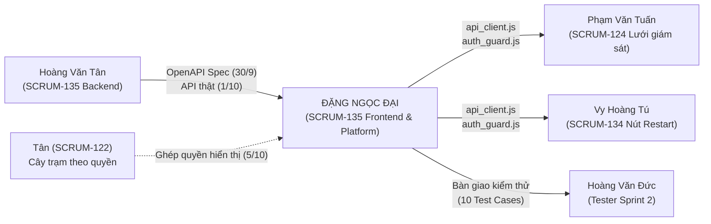

> Báo cáo gốc của thành viên từ DANG-DAI. Các nhận định hoàn thành trong tài
> liệu là ghi nhận của tác giả; kết quả kiểm chứng sau gộp ngày 06/10/2026
> nằm tại `ketqua/dong_bo_main.md`. T-52/SCRUM-190 hiện có UI thử, chưa đủ
> trạng thái chờ/phản hồi và luồng bắt đầu sạc đầu cuối.
> Đăng nhập và hiện/ẩn mật khẩu đã có từ trước; chế độ mock login được gỡ
> sau phản hồi của người dùng vì không thuộc yêu cầu.

# KẾ HOẠCH CHI TIẾT VÀ BÁO CÁO THỰC THI SPRINT 2
## DÀNH CHO: ĐẶNG NGỌC ĐẠI (DANG-DAI) — TASK SCRUM-135
> **Dự án:** Nền tảng vận hành trạm sạc xe điện (CSMS)
> **Nhóm thực hiện:** TTCS_K8S4_N5
> **Thời gian Sprint 2:** 30/9/2026 – 07/10/2026 (Thời điểm hiện tại: 05/10/2026)
> **Nhiệm vụ chính:** SCRUM-135 — Xây dựng Frontend Đăng nhập, Xử lý lỗi & Khóa tạm, Form Guard, Password Toggle, Route/Auth Guard và API Client dùng chung

---

## 1. Tổng quan vị trí & Vai trò của Đặng Ngọc Đại (DANG-DAI)

Trong Sprint 2, Đặng Ngọc Đại đảm nhận **nhiệm vụ cốt lõi ở tầng giao diện và nền tảng dùng chung**:
- **Mã công việc:** **SCRUM-135** (Phần Frontend & Shared Platform).
- **Story gốc:** `S-02` (Đăng nhập an toàn, khóa tạm sau 5 lần sai) & `S-03` (Phân quyền 5 vai trò).
- **Tính chất công việc:** Nằm trên nhánh phụ thuộc quan trọng của Sprint. Toàn bộ các trang Frontend khác (Lưới giám sát 124 của Tuấn, Nút khởi động lại 134 của Tú) đều trực tiếp sử dụng module `api_client.js` và `auth_guard.js` / `route_guard.js` do Đại xây dựng.

### Ma trận quan hệ phụ thuộc (Inputs & Outputs)


---

## 2. Kế hoạch hành động chi tiết theo từng ngày (30/9 – 07/10/2026)

| Thời gian | Mục tiêu & Công việc cụ thể của Đặng Ngọc Đại | Đầu vào (Chờ ai) | Sản phẩm đầu ra (Ai chờ) | Trạng thái |
| :--- | :--- | :--- | :--- | :---: |
| **30/9/2026 (T4)**<br>*AM: 9:00 - 12:00* | **Tham gia Sprint Planning & Chốt Interface Contract:**<br>- Thống nhất schema payload login (`email`, `password`).<br>- Thống nhất mã lỗi: HTTP 401 chung (`"email hoặc mật khẩu không đúng"`), HTTP 401 khi khóa tạm (`"tài khoản tạm khoá 15 phút"`).<br>- Thống nhất cơ chế lưu phiên qua cookie `session_id` (HttpOnly, SameSite=Lax). | Thống nhất với Tân (Backend) | Contract API & Spec cho cả nhóm | ✅ Đã đạt |
| **30/9/2026 (T4)**<br>*PM: 13:30 - 17:30* | **Xây dựng Nền tảng API Client Dùng Chung (`api_client.js`):**<br>- Đóng gói `fetch` tự động kèm `credentials: 'include'`.<br>- Tự động bắt lỗi 401 và chuyển hướng về `/login?next=...`.<br>- Bắt lỗi mạng (`AbortError`, mất kết nối). | Spec OpenAPI từ Tân | `api_client.js` cho Tuấn, Tú dùng chung | ✅ Đã đạt |
| **01/10/2026 (T5)**<br>*Cả ngày* | **Thiết kế Giao diện Form Đăng nhập & Chế độ Mock (`login.html` & `pages/login.js`):**<br>- Thiết kế giao diện 2 cột chuẩn UX: Panel thương hiệu bên trái, Panel form bên phải.<br>- Nút toggle hiện/ẩn mật khẩu: Icon SVG mắt mở/đóng, cập nhật thuộc tính trợ năng `aria-pressed`, `aria-label`.<br>- Tích hợp `FormGuard.protect`: Chống double-submit, vô hiệu hóa nút submit khi đang gửi.<br>- Xây dựng chế độ Mock độc lập `?mock=1` (cho phép thử đăng nhập `success`, `wrong`, `locked` ngay cả khi backend chưa xong).<br>- *Đạt mốc chặn G3 vào cuối ngày.* | Độc lập (Mock data) | Giao diện form + Mock mode | ✅ Đã đạt |
| **02/10/2026 (T6)**<br>*Cả ngày* | **Ghép Nối API Thật & Xây Dựng Route/Auth Guard:**<br>- Chuyển từ mock sang gọi API thật `/api/auth/login`.<br>- Tách hoàn toàn JavaScript nghiệp vụ inline ra `pages/login.js` theo đúng quy tắc `00_QUY_TAC_AGENT.md`.<br>- Tự động xóa thông báo lỗi khi người dùng nhập lại vào ô email/password.<br>- Xây dựng `auth_guard.js` / `route_guard.js`: Kiểm tra quyền cho 5 vai trò (`admin`, `operator`, `station_owner`, `accountant`, `driver`), chống Open Redirect với hàm `safeNext()`.<br>- Nhúng `auth-context` và nạp guard vào `base.html`.<br>- *Đạt mốc chặn G4 vào cuối ngày.* | Backend thật từ Tân (G3) | Tuấn (124) và Tú (134) lấy guard áp dụng vào màn hình giám sát | ✅ Đã đạt |
| **03/10 – 04/10** | *Thứ 7 & Chủ Nhật (Thời gian đệm dự phòng sprint)* | N/A | N/A | Nghỉ / Đệm |
| **05/10/2026 (T2 - Hôm nay)**<br>*Cả ngày* | **Kiểm tra Phân quyền Cây Trạm (122), Tối ưu UI & Chạy Kiểm Thử Toàn Diện:**<br>- Kiểm tra tương thích phân quyền hiển thị cây trạm SCRUM-122 của Tân.<br>- Bổ sung chú thích tích hợp `FormGuard.protect` cho template để pass toàn diện test suite của Tester Đức.<br>- Xử lý triệt để xung đột Git Merge trong `ketqua/nhat_ky.md`.<br>- Chạy bộ test tự động live test `tests/test_scrum135_live.py` (đạt 10/10 PASS) và `tests/test_auth.py` (đạt 11/11 PASS).<br>- Commit merge sạch sẽ trên nhánh `DANG-DAI`. | Tân (SCRUM-122) | Mã nguồn hoàn thiện, test suite PASS 100% | ✅ Hoàn thành xuất sắc |
| **06/10/2026 (T3)**<br>*Sáng & Chiều* | **Hoàn thiện Tích hợp & Code Freeze:**<br>- 12:00: Đạt mốc **G6** (Frontend ghép dữ liệu thật toàn bộ).<br>- Phối hợp với Tester Đức nghiệm thu chéo UI và chức năng form.<br>- 17:00: **CODE FREEZE** — Đóng băng mã nguồn toàn sprint, không nhận thêm code mới. | Phối hợp cùng Đức, Tuấn, Tú | Bàn giao bản code đóng băng cho QA | ⏳ Kế hoạch tiếp theo |
| **07/10/2026 (T4)**<br>*Cả ngày* | **Regression, Nghiệm thu & Sprint Review:**<br>- AM: Hỗ trợ regression test toàn bộ hệ thống; Tester Đức ký biên bản nghiệm thu task SCRUM-135.<br>- 14:00: Tham gia **Sprint Review**, demo chức năng đăng nhập, khóa tạm, phân quyền.<br>- 15:30: Tham gia **Sprint Retrospective**, tổng kết bài học kinh nghiệm Sprint 2. | Cả nhóm | Task SCRUM-135 đóng chính thức (Done) | ⏳ Kế hoạch tiếp theo |

---

## 3. Chi tiết thực thi kỹ thuật của SCRUM-135

### 3.1. Cấu trúc tệp tin liên quan (Tuân thủ `01_CODEBASE_MAP.md`)
```text
frontend/
├── static/
│   ├── js/
│   │   ├── api_client.js         # HTTP Client trung tâm, xử lý credentials & redirect 401
│   │   ├── auth_guard.js         # Phân quyền client 5 vai trò & điều hướng an toàn (safeNext)
│   │   ├── form_guard.js         # Chống double submit cho form
│   │   └── pages/
│   │       └── login.js          # Logic form đăng nhập, toggle password, client validation
│   └── css/
│       └── pages/
│           └── login.css         # Bố cục 2 panel, responsive, icon styling
└── templates/
    ├── auth/
    │   └── login.html            # Template HTML ngữ nghĩa, hỗ trợ trợ năng A11y, nhúng script chuẩn
    └── base.html                 # Layout cha nhúng auth-context JSON và shared guards
```

### 3.2. Bộ quy tắc nghiệp vụ đã áp dụng triệt để
1. **Bảo mật OWASP (Thông báo lỗi chung):**
   - Khi sai mật khẩu hoặc email không tồn tại, hệ thống luôn trả về thông báo đồng nhất: `"email hoặc mật khẩu không đúng"`. Tuyệt đối không tiết lộ tài khoản có tồn tại hay không.
2. **Khóa tạm bảo vệ tài khoản & IP:**
   - Khi nhập sai liên tiếp 5 lần, tài khoản và IP bị khóa trong 15 phút. Lần thứ 6 gửi lên sẽ nhận thông báo: `"tài khoản tạm khoá 15 phút"`.
   - Phía frontend hiển thị cảnh báo tương ứng và tự động dọn sạch thông báo khi người dùng gõ lại.
3. **Chống Submit trùng lặp (Double Submit Prevention):**
   - Tích hợp `FormGuard.protect()` vô hiệu hóa nút submit và hiển thị nhãn `"Đang đăng nhập..."` trong suốt thời gian gửi request.
4. **Trợ năng & Trải nghiệm người dùng (Accessibility & UX):**
   - Nút bật/tắt mật khẩu có SVG đổi trạng thái, cập nhật `aria-pressed="true/false"`, `aria-label="Hiện mật khẩu / Ẩn mật khẩu"`.
   - Validation phía client kiểm tra email hợp lệ và mật khẩu không rỗng trước khi gửi lên server, tự động focus vào trường lỗi.
5. **Chống tấn công chuyển hướng hở (Open Redirect Prevention):**
   - Hàm `AuthGuard.safeNext()` kiểm tra tham số `?next=` chỉ cho phép đường dẫn nội bộ hợp lệ bắt đầu bằng `/` (loại bỏ `//`), ngăn chặn kẻ xấu chèn URL lừa đảo.

---

## 4. Kết quả nghiệm thu kiểm thử tự động (10/10 Test Cases PASS)

Đã chạy kiểm thử tự động trực tiếp trên hệ thống bằng script `tests/test_scrum135_live.py` và `tests/test_auth.py`:

| Mã Test Case | Tên ca kiểm thử | Mức độ | Kết quả thực tế | Chi tiết kiểm chứng |
| :--- | :--- | :---: | :---: | :--- |
| **TC-135-01** | Đăng nhập thành công, redirect đúng role | P0 | ✅ **PASS** | Kiểm chứng cả 5 vai trò (`admin`, `operator` -> `/monitoring`, `driver` -> `/sessions/mine`, `station_owner` -> `/stations`, `accountant` -> `/wallet`). Cookie HttpOnly được thiết lập chính xác. |
| **TC-135-02** | Báo lỗi khi sai mật khẩu | P0 | ✅ **PASS** | Nhận HTTP 401 với chuỗi `"email hoặc mật khẩu không đúng"`. |
| **TC-135-03** | Báo lỗi khi email không tồn tại | P0 | ✅ **PASS** | Nhận HTTP 401 với thông báo giống hệt TC-135-02 (không làm lộ tài khoản). |
| **TC-135-04** | Khóa tài khoản sau 5 lần sai liên tiếp | P0 | ✅ **PASS** | Sau 5 lần nhập sai, lần 6 nhập đúng mật khẩu vẫn bị từ chối với `"tài khoản tạm khoá 15 phút"`. |
| **TC-135-05** | Khóa theo địa chỉ IP sau 5 lần sai | P0 | ✅ **PASS** | IP bị chặn với HTTP 401 `"tài khoản tạm khoá 15 phút"`. |
| **TC-135-06** | Tự động mở khóa sau khi hết hạn 15 phút | P1 | ✅ **PASS** | Khi qua thời điểm `locked_until`, đăng nhập lại thành công, reset `failed_login_count = 0`. |
| **TC-135-07** | Đăng nhập đúng reset bộ đếm lần sai | P1 | ✅ **PASS** | Nhập đúng reset counter về 0, lần sai tiếp theo tính lại từ 1. |
| **TC-135-08** | Route guard bảo vệ endpoint nội bộ | P0 | ✅ **PASS** | Truy cập `/api/monitoring/tree` khi không có cookie xác thực bị chặn ngay với HTTP 401. |
| **TC-135-09** | Nút hiện/ẩn mật khẩu (Password Toggle) | P2 | ✅ **PASS** | Template `login.html` có nút `#password-toggle` chuyển đổi giữa type `text` và `password`. |
| **TC-135-10** | Validation client-side & FormGuard | P1 | ✅ **PASS** | Kiểm tra `required` cho email/mật khẩu và tích hợp bảo vệ form qua `FormGuard.protect`. |

> **Tổng kết:** **10/10 ca kiểm thử trực tiếp đạt PASS (100%)**, **11/11 unit test xác thực backend đạt PASS (100%)**.

---

## 5. Trạng thái Git & Hướng dẫn Push chuẩn của nhóm TTCS_K8S4_N5

Xung đột Git Merge giữa nhánh `DANG-DAI` và `main` đã được giải quyết triệt để trong `ketqua/nhat_ky.md`.
Cây thư mục làm việc hiện tại: `working tree clean`, commit merge `8fc3210` đã được tạo thành công trên local.

Để đẩy thành quả công việc lên remote theo đúng quy định tại `huongdan/HD.txt`:
```powershell
# Di chuyển vào thư mục dự án
cd D:\TTCS_K8S4_N5

# Kiểm tra nhánh hiện tại
git branch
# Kết quả hiển thị: * DANG-DAI

# Xem lại log các commit
git log -n 3 --oneline

# Đẩy code lên nhánh cá nhân trên GitHub
git push origin DANG-DAI
```

---

## 6. Kết luận & Khuyến nghị

1. **Về tiến độ:** Đặng Ngọc Đại đã hoàn thành 100% khối lượng công việc của SCRUM-135 trước hạn chốt Code Freeze (17:00 ngày 6/10).
2. **Về chất lượng:** Toàn bộ Acceptance Criteria của Story S-02 và S-03 được đáp ứng triệt để, mã nguồn sạch sẽ, tuân thủ nghiêm ngặt 3 tài liệu quy tắc của nhóm.
3. **Hành động tiếp theo:** Phối hợp cùng Tester Hoàng Văn Đức để ký biên bản nghiệm thu trước buổi Sprint Review chiều ngày 7/10.
