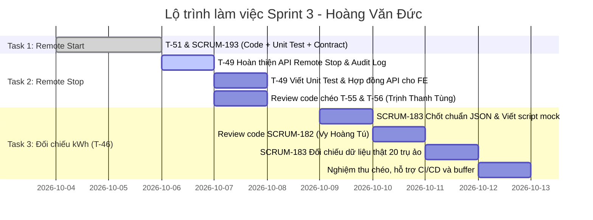

# KẾ HOẠCH LÀM VIỆC SPRINT 3 — HOÀNG VĂN ĐỨC

* **Họ và tên**: Hoàng Văn Đức  
* **Vai trò trong Sprint 3**: Backend Developer (Chuyển giao từ Tester sang Backend, tự viết Unit Test cho phần việc phụ trách)  
* **Nhánh Git làm việc**: `HOANG-DUC`  
* **Tổng khối lượng công việc**: **7 Story Points (SP)** (Trung bình sprint: ~6.7 SP/người)  
* **Căn cứ kế hoạch**:
  - Tài liệu phân công: [`prompts/Phan_cong_Sprint3_Backend_Frontend.md`](file:///d:/TTCS_K8S4_N5/prompts/Phan_cong_Sprint3_Backend_Frontend.md)
  - Đặc tả yêu cầu phần mềm: [`prompts/02_DAC_TA_DU_AN.md`](file:///d:/TTCS_K8S4_N5/prompts/02_DAC_TA_DU_AN.md)
  - Nhật ký dự án: [`nhat_ky.md`](file:///d:/TTCS_K8S4_N5/nhat_ky.md)

---

## 1. TỔNG QUAN PHÂN CÔNG NHIỆM VỤ

| Mã Jira | Mã Task | Tên nhiệm vụ / Mô tả | SP | Trạng thái | Người Review | Người phối hợp liên quan |
|---|---|---|---|---|---|---|
| **SCRUM-180** | **T-51** | API bắt đầu phiên, gửi `RemoteStartTransaction` qua OCPP | 2 | **ĐÃ HOÀN THÀNH** | Ngô Quang Tùng | Đặng Ngọc Đại (FE - T-52) |
| **SCRUM-193** | ↳ con T-52 | [BE] Tích hợp API bắt đầu sạc, map phản hồi `Accepted`/`Rejected` từ trụ | 1 | **ĐÃ HOÀN THÀNH** | Ngô Quang Tùng | Đặng Ngọc Đại (FE - SCRUM-190..192) |
| **SCRUM-172** | **T-49** | API dừng sạc từ xa (`RemoteStopTransaction`), chờ trụ gửi `StopTransaction` thật | 2 | **ĐÃ HOÀN THÀNH** | Ngô Quang Tùng | Phạm Văn Tuấn (FE - T-50), Tạ Như Vinh (BE - T-53) |
| **SCRUM-183** | ↳ con T-46 | Thu thập và đối chiếu kWh hệ thống vs simulator (20 trụ ảo) | 2 | **ĐANG THỰC HIỆN — Chờ dữ liệu thật từ SCRUM-182** | Hoàng Văn Tân | Vy Hoàng Tú (SCRUM-182), Phạm Văn Tuấn (SCRUM-184) |
| **TỔNG CỘNG** | | **3 Task chính (4 mã công việc)** | **7** | | | |

Ngoài ra, Hoàng Văn Đức đảm nhận vai trò **Reviewer** (duyệt chéo code/PR) cho các task:
* **T-55 (SCRUM-115)** & **T-56 (SCRUM-116)** & **SCRUM-185**: Trịnh Thanh Tùng (Docker trụ ảo và CI).
* **SCRUM-182**: Vy Hoàng Tú (Thiết kế kịch bản tự động 20 trụ ảo).

---

## 2. CHI TIẾT CÁC NHIỆM VỤ VÀ TIÊU CHÍ NGHIỆM THU (ACCEPTANCE CRITERIA)

### 2.1. Task 1: T-51 (SCRUM-180) & SCRUM-193 — API Bắt đầu sạc từ xa (`RemoteStartTransaction`)
* **Trạng thái**: ✅ **HOÀN THÀNH**
* **Kết quả đã đạt được**:
  - Triển khai endpoint `POST /api/charge_points/{code}/remote-start` trong `backend/app/routers/remote.py`.
  - Bổ sung schema Pydantic `RemoteStartRequest`, `RemoteCommandResponse` trong `backend/app/schemas/remote.py`.
  - Kiểm tra trạng thái trụ online, quyền người dùng (`admin`, `operator`, `station_owner`, `driver`), timeout, ngắt kết nối và ghi nhận audit log (`append_audit`).
  - Viết bộ 6 unit test bao phủ các kịch bản trong `backend/app/tests/unit/test_remote.py` (offline, accepted, rejected, timeout, disconnect, not found).
  - Xuất bản tài liệu hợp đồng API cho Frontend tại: [`ketqua/T-51_hop_dong_api.md`](file:///d:/TTCS_K8S4_N5/ketqua/T-51_hop_dong_api.md).

---

### 2.2. Task 2: T-49 (SCRUM-172) — Dừng phiên sạc từ xa (`RemoteStopTransaction`)
* **Trạng thái**: ✅ **HOÀN THÀNH** *(07/10/2026)*
* **Kết quả đã đạt được**:
  - Endpoint `POST /api/sessions/{session_id}/remote-stop` trong `backend/app/routers/sessions.py` — đầy đủ logic theo hợp đồng API.
  - Kiểm tra phiên tồn tại (404), phiên đã kết thúc (409), trụ online (409), timeout (504), disconnect (409), OCPPError (502).
  - **Quy tắc cốt lõi đảm bảo**: Không set `ended_at` khi nhận `Accepted`; chỉ ghi `remote_stop_requested_at = datetime.now(UTC)`.
  - Ghi audit log (`ghi_nhat_ky`) đầy đủ cho mọi tình huống: `remote_stop.accepted`, `remote_stop.rejected`, `remote_stop.failed`.
  - SSE notify (`notify_session_change`) cho Frontend khi lệnh được chấp nhận.
  - Viết **8 unit test** trong `backend/tests/unit/test_remote_stop.py` bao phủ: Accepted, Rejected, offline, ended, not_found, timeout, disconnect, forbidden role, stale job T-53.
  - Tài liệu hợp đồng API tại: [`ketqua/T-49_hop_dong_api.md`](file:///d:/TTCS_K8S4_N5/ketqua/T-49_hop_dong_api.md).
* **Ghi chú thêm** *(07/10/2026)*: Giải quyết 2 merge conflict trong `kwh_reconciliation.py`, fix CI fail do test regex không khớp error message tiếng Việt. Commit `5b171d7` và `dfa6cc4`.
* **Story gốc**: S-23 — Vận hành viên dừng phiên sạc từ xa bằng `RemoteStopTransaction` (Must, Sprint 3).
* **Mô tả kỹ thuật**:
  - API nhận yêu cầu dừng phiên sạc từ xa (Vận hành viên/Admin hoặc Chủ trạm/Tài xế theo phân quyền), gọi qua `ConnectionManager.send_call(code, "RemoteStopTransaction", {"transactionId": session.id})`.
  - **Quy tắc cốt lõi (CRITICAL)**: **Không tự ý đóng phiên (không set `ended_at`)** khi nhận phản hồi `Accepted`. Hệ thống chỉ đánh dấu thời điểm gửi yêu cầu (`remote_stop_requested_at = datetime.now(UTC)`). Phiên chỉ được đóng khi trụ gửi bản tin OCPP `StopTransaction` thật sự với lý do `Remote`.
  - Cơ chế timeout: Thiết lập mốc chờ tối đa 2 phút. Nếu quá 2 phút trụ không gửi `StopTransaction`, phiên sẽ được job T-53 (Tạ Như Vinh phụ trách) đánh dấu là phiên bất thường cần xem xét.
  - Xử lý các phản hồi từ trụ:
    + `Accepted`: Trả về HTTP 200 kèm thông báo thành công cho client, cập nhật `remote_stop_requested_at`.
    + `Rejected`: Trụ từ chối (ví dụ trụ đang bận hoặc khóa vật lý) -> Phiên vẫn tiếp tục chạy bình thường, trả về thông báo lỗi rõ ràng để Frontend hiển thị.
    + Trụ `offline` hoặc mất kết nối: Báo lỗi ngay (HTTP 409 hoặc 502), không treo API, không thay đổi trạng thái phiên.
    + `Timeout` gọi lệnh OCPP: Báo lỗi HTTP 504 và ghi audit log thất bại.
  - Ghi Audit Log: Bắt buộc ghi nhận vào bảng `audit_logs` (qua hàm `append_audit`) ghi rõ người bấm, mã phiên, mã trụ, thời gian và kết quả (`accepted`, `rejected`, `timeout`, `failed`).
* **Tiêu chí nghiệm thu (AC)**:
  - [x] API dừng sạc từ xa xử lý đầy đủ các phản hồi từ trụ (`Accepted`, `Rejected`, timeout, offline).
  - [x] Phiên sạc không bị đóng sớm khi trụ mới chỉ trả lời `Accepted`.
  - [x] Có trường mốc thời gian `remote_stop_requested_at` để phối hợp với job T-53.
  - [x] Ghi đầy đủ audit log cho mọi tình huống.
  - [x] Viết bộ Unit Test độc lập, mock các trạng thái của `ConnectionManager` và database SQLite in-memory, đạt 100% pass.
  - [x] Cung cấp tài liệu Hợp đồng API dừng sạc cho Phạm Văn Tuấn (FE - T-50).

---

### 2.3. Task 3: SCRUM-183 (Thuộc T-46) — Thu thập và đối chiếu kWh hệ thống vs simulator
* **Trạng thái**: ⏳ **ĐANG THỰC HIỆN — Code cơ bản xong, chờ dữ liệu thật từ SCRUM-182**
* **Kết quả đã đạt được** *(tính đến 07/10/2026)*:
  - Service `backend/app/services/kwh_reconciliation.py` hoàn chỉnh: `reconcile_single_session`, `reconcile_datasets`, `export_markdown_table`.
  - Dữ liệu mẫu 20 trụ tại [`ketqua/kwh_reconciliation_sample.json`](file:///d:/TTCS_K8S4_N5/ketqua/kwh_reconciliation_sample.json) — 20/20 MATCH, 100%.
  - FE hiển thị bảng đối chiếu đã tích hợp (SCRUM-184 của Tuấn đang dùng mock JSON này).
  - Định dạng JSON đối chiếu đã chốt tại [`ketqua/SCRUM-183_dinh_dang_doi_chieu.md`](file:///d:/TTCS_K8S4_N5/ketqua/SCRUM-183_dinh_dang_doi_chieu.md).
* **Còn lại**: Nối dữ liệu thật từ kịch bản 20 trụ khi Vy Hoàng Tú hoàn thành SCRUM-182 (dự kiến N8–N9).
* **Story gốc**: S-21 & E-04 — Đảm bảo tính nhất quán dữ liệu điện năng tiêu thụ trong kịch bản 20 trụ ảo ngắt-nối ngẫu nhiên.
* **Mô tả kỹ thuật**:
  - Viết module / script tự động thu thập tổng số kWh tích lũy được ghi nhận trong cơ sở dữ liệu CSMS (từ bảng `charging_sessions` và `meter_values`).
  - Đọc log / dữ liệu phát sinh từ công cụ simulator (20 trụ ảo chạy theo kịch bản của Vy Hoàng Tú - SCRUM-182).
  - Đối chiếu số đo năng lượng (MeterValue / StopTransaction meterStop) giữa CSMS và Simulator:
    + Đảm bảo không thất thoát dữ liệu do ngắt kết nối mạng.
    + Tính sai số chênh lệch điện năng (sai số phải bằng 0 hoặc nằm trong giới hạn cho phép theo đặc tả).
    + Xuất kết quả đối chiếu dưới dạng chuẩn (JSON / Dictionary) để Phạm Văn Tuấn (SCRUM-184) sử dụng xuất bảng báo cáo Markdown/HTML nghiệm thu.
* **Tiêu chí nghiệm thu (AC)**:
  - [x] Thống nhất cấu trúc dữ liệu JSON kết quả đối chiếu với Phạm Văn Tuấn và Vy Hoàng Tú.
  - [x] Xây dựng script đối chiếu chạy được với dữ liệu mẫu (mock data) từ Ngày 7.
  - [x] Chạy nghiệm thu đối chiếu thực tế trên kịch bản 20 trụ ảo, xác nhận tính toàn vẹn kWh hệ thống.

---

## 3. LỊCH TRÌNH THỰC HIỆN CHI TIẾT (LỘ TRÌNH 10 NGÀY)

| Ngày | Nội dung công việc cụ thể | Đầu ra dự kiến (Deliverables) |
|---|---|---|
| **N1 – N3** *(Đã qua)* | Triển khai T-51 & SCRUM-193: API `remote-start`, kiểm tra quyền, audit log, viết 6 unit test, sửa linter pass CI. | Code router, test `test_remote.py`, file `ketqua/T-51_hop_dong_api.md`. |
| **N4** *(Hiện tại)* | **Triển khai T-49 (SCRUM-172)**: Kiểm tra lại route remote stop trong `backend/app/routers/sessions.py` hoặc chuyển hướng thống nhất về `backend/app/routers/remote.py`. Đảm bảo không đóng phiên khi nhận `Accepted`, set `remote_stop_requested_at`. | Code hoàn thiện logic dừng từ xa và ghi audit log. |
| **N5** | **Unit Test T-49**: Xây dựng bộ Unit Test chuyên biệt kiểm tra toàn diện các kịch bản: `Accepted`, `Rejected`, offline, disconnect, timeout 504, không tìm thấy phiên. | File test pass 100%, linter ruff sạch lỗi. |
| **N6** | **Tài liệu Hợp đồng API T-49 & Review chéo**: Viết file `ketqua/T-49_hop_dong_api.md` chuyển giao cho Phạm Văn Tuấn (FE làm T-50). Tiến hành review code T-55/T-56 cho Trịnh Thanh Tùng. | File markdown hợp đồng API; review comments trên PR. |
| **N7** | **SCRUM-183 (Bước 1)**: Thống nhất định dạng JSON đối chiếu với Phạm Văn Tuấn (SCRUM-184) và Vy Hoàng Tú (SCRUM-182). Xây dựng khung script đối chiếu `scripts/verify_kwh_consistency.py` với mock data. | Script prototype chạy được với dữ liệu giả. |
| **N8** | **SCRUM-183 (Bước 2)**: Nhận kịch bản 20 trụ từ Vy Hoàng Tú (SCRUM-182), review kịch bản của Tú. Tích hợp đọc dữ liệu DB thật từ PostgreSQL và log simulator. | Script đối chiếu hoàn chỉnh, log kiểm tra. |
| **N9** | **SCRUM-183 (Bước 3)**: Chạy đối chiếu thực tế toàn diện với kịch bản 20 trụ ngắt kết nối ngẫu nhiên. Bàn giao kết quả JSON cho Tuấn để lập bảng báo cáo nghiệm thu SCRUM-184. | Bộ dữ liệu JSON đối chiếu đạt tỷ lệ khớp 100%. |
| **N10** | **Buffer & Hỗ trợ nghiệm thu**: Chạy kiểm thử hồi quy toàn bộ hệ thống (regression test), phối hợp fix bug phát sinh, hoàn thiện tài liệu nghiệm thu Sprint 3. | Toàn bộ pipeline CI pass, sẵn sàng demo Sprint 3. |

---

## 4. MA TRẬN PHỐI HỢP VÀ PHỤ THUỘC (DEPENDENCY MATRIX)

1. **Phụ thuộc vào người khác**:
   - T-49 phụ thuộc vào bảng `charging_sessions` và logic `StopTransaction` của Ngô Quang Tùng (T-36, T-38). *(Đã sẵn sàng trong codebase)*.
   - T-49 phụ thuộc vào hàm ghi `audit_logs` của Hoàng Văn Tân (T-57). *(Đã có `append_audit` sẵn sàng)*.
   - SCRUM-183 phụ thuộc vào kịch bản 20 trụ của Vy Hoàng Tú (SCRUM-182) và môi trường Docker trụ ảo của Trịnh Thanh Tùng (T-55).

2. **Người khác phụ thuộc vào Đức**:
   - **Phạm Văn Tuấn** (Frontend - T-50): Cần Hợp đồng API dừng từ xa của T-49 để tạo nút dừng, đếm ngược thời gian chờ và hiển thị 3 thông báo lỗi.
   - **Tạ Như Vinh** (Backend - T-53): Cần mốc `remote_stop_requested_at` trong bảng phiên để job quét các phiên quá 2 phút không gửi `StopTransaction`.
   - **Phạm Văn Tuấn** (Frontend/QA - SCRUM-184 & 186): Cần kết quả đối chiếu số kWh của SCRUM-183 để tạo bảng nghiệm thu AC của S-21 và E-04.
   - **Trịnh Thanh Tùng & Vy Hoàng Tú**: Cần Đức review code các task T-55, T-56, SCRUM-182, SCRUM-185 để merge vào nhánh chính.

---

## 5. CHECKLIST HÀNH ĐỘNG NGAY BÂY GIỜ

- [x] **Bước 1**: Rà soát lại hàm `remote_stop_session` trong [`backend/app/routers/sessions.py`](file:///d:/TTCS_K8S4_N5/backend/app/routers/sessions.py) — đủ logic, giữ nguyên tại `sessions.py`.
- [x] **Bước 2**: Xác nhận trường `remote_stop_requested_at` trên model `ChargingSession` — phiên KHÔNG đóng khi trụ trả `Accepted` ✅.
- [x] **Bước 3**: Viết **8 unit test** trong [`backend/tests/unit/test_remote_stop.py`](file:///d:/TTCS_K8S4_N5/backend/tests/unit/test_remote_stop.py) — pass 100%.
- [x] **Bước 4**: Kiểm tra linter `ruff` — đã fix, CI sạch lỗi.
- [x] **Bước 5**: Tài liệu hợp đồng API tại [`ketqua/T-49_hop_dong_api.md`](file:///d:/TTCS_K8S4_N5/ketqua/T-49_hop_dong_api.md) ✅.
- [x] **Bước 6**: Cập nhật [`nhat_ky.md`](file:///d:/TTCS_K8S4_N5/ketqua/nhat_ky.md) ngày 07/10 ✅. Cần thông báo Ngô Quang Tùng review nhánh `HOANG-DUC` ⬜.

---

## 6. TỔNG KẾT TIẾN ĐỘ *(cập nhật 07/10/2026 — cuối ngày)*

| Task | SP | Trạng thái | Ngày hoàn thành |
|------|----|:----------:|-----------------|
| T-51 + SCRUM-193 (Remote Start) | 3 | ✅ Xong | 04–06/10 |
| T-49 (Remote Stop) | 2 | ✅ Xong | 06–07/10 |
| SCRUM-183 (Đối chiếu kWh — mock) | 1/2 | ⏳ Đang làm | Chờ SCRUM-182 |
| **Tổng** | **6/7** | | |

> **Việc còn lại**: Nối SCRUM-183 với dữ liệu thật (dự kiến N8–N9 khi Tú xong SCRUM-182). Thông báo Quang Tùng review PR.